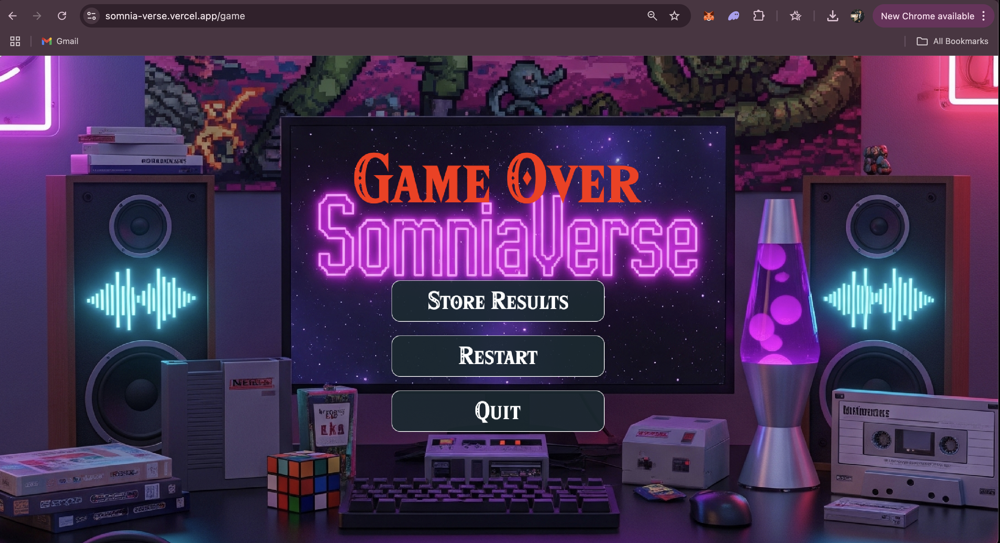
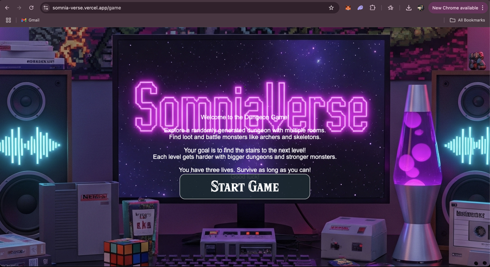

<p align="center">
</p>

# 🎮 SHADOW STAKE SAGA - Next-Gen Blockchain Dungeon Crawler

Welcome to **SHADOW STAKE SAGA**, an infinite AI-powered procedural dungeon-crawling adventure where danger lurks around every corner! 🧙‍♂️⚔️ 

Explore mysterious dungeons, collect treasures, defeat fearsome enemies, and race to find the stairs to escape to the next level! But beware—each level gets harder, and you only have 3 lives. Can you survive the darkness and climb to glory?

💰 **Earn as You Play!** The score you collect can be minted into Shadow Stake Saga ($SSS) tokens, making every adventure not just thrilling but also rewarding! 🚀🔥

## 🌟 What Makes SHADOW STAKE SAGA Special?

✅ **AI-Generated Dungeons** - Neural networks create unique dungeons tailored to your play style
✅ **Adaptive Boss AI** - Bosses learn from your tactics and adapt in real-time
✅ **OneChain Blockchain** - Fully deployed on OneChain testnet
✅ **Real Blockchain Storage** - Scores stored on-chain via Move smart contracts
✅ **Live Leaderboard** - Fetch all players' scores from blockchain events
✅ **Verifiable Gameplay** - All transactions visible on OneChain explorer
✅ **OneWallet Integration** - Seamless wallet connection and transaction signing

## ⚙️ How It Works

### 🕹️ Gameplay Mechanics

- **AI-Generated Dungeons**: Neural networks create unique dungeons based on your play style and skill level
- **5 Enemy Types**:
  - 💀 Skeletons: Common foes with average stats
  - 🏹 Archers: Long-range attacks with higher HP and DPS
  - 🐺 Shadow Beasts: Fast and aggressive melee fighters
  - 👻 Elemental Wraiths: Powerful ranged casters
  - 🧙 Necromancers: Summoners with high HP
- **4 Boss Types**:
  - 👑 Skeleton King: Summons minions at phase thresholds
  - 🌑 Shadow Lord: Teleports and becomes more aggressive
  - 🗿 Elemental Titan: Gains shields at different phases
  - ☠️ Necro Overlord: Enrages at 50% health
- **Loot System**: Collect coins to increase your score and HP:
  - 🪙 Silver (Common)
  - 🟡 Gold (Uncommon)
  - 🟢 Emerald (Rare)
  - 🔴 Ruby (Epic)
  - 💠 Diamond (Legendary)
- **Skill Tree**: 10+ upgradeable skills across Combat, Survival, Mobility, and Utility
- **Weapon System**: 6 weapon types with unique stats and abilities
- **Hazard System**: Environmental dangers like spike traps, poison gas, and lava pools

### 🎮 Objective

Explore rooms, defeat enemies, and find the stairs to advance to the next level. With each new level, the dungeon grows larger, enemies get tougher, and the stakes get higher!

### 🔥 Scoring System

- Defeat enemies to boost your score.
- Collect rare loot for extra points and perks.
- 💀 3 Lives: When your three lives are up, Game Over! Save your scores and records on-chain to earn perks for future runs.

---

## 🛠️ Built for OneChain Hackathon

This game features **35+ new files** with comprehensive Web3 integrations and cutting-edge AI systems:

### 💰 **Tokenomics** (7 Systems)
- Token Burn Mechanism, NFT System, RWA Integration, Staking, DeFi Pools, Marketplace, Guild System

### 👥 **Social Features** (6 Features)
- Multiplayer Mode, Global Leaderboards, Async Co-op, Social Login, Raid System, Clan Wars

### 🔗 **OneChain Integration** (5 Features)
- OneWallet Integration, Gasless Transactions, MPC Wallets, USDO Pools, Mobile Optimization

### 🤖 **Innovation Layer** (5 AI Systems)
- AI-Generated Dungeons, Adaptive Boss AI, Cross-Chain Bridge (5 chains), DAO Governance, Player-Trained AI

### 🛡️ **Security & Anti-Cheat** (5 Systems)
- Server-Side Validation, Commit-Reveal Scheme, Rate Limiting, Cheat Detection (10 patterns), Bot Protection

### 📜 **Smart Contracts (OneChain Testnet)**
- **Game Package**: `0x3d16067dbdb2afe434f636d860fd02400ef57421def3b89ee424f9c3b354ec45`
- **SSS Treasury Cap**: `0x145a0d68fe2ea23eb0ee7033a018d5dcbeba8579d3853fce9f908008d2539cf8`
- **Upgrade Cap**: `0x42370d4c37387a63550e4b71aa64cc5442ee2dde086a9f1adfff604da42fb080`
- **Network**: OneChain Testnet
- **RPC**: `https://rpc-testnet.onelabs.cc`
- **Explorer**: [OneChain Explorer](https://onescan.cc/testnet/home)

📚 **Full Documentation**: 
- `INNOVATION_LAYER.md` - AI systems and innovation features
- `ONECHAIN_INTEGRATION.md` - OneChain integration details
- `SECURITY_ANTICHEAT.md` - Security and anti-cheat systems

---

## ✅ Implemented Features

🎉 **ALL features are now implemented!**

✅ **Core Gameplay** - 5 enemy types, procedural dungeons, 3-lives system
✅ **OneChain Integration** - Scores stored on blockchain via Move contracts
✅ **Live Leaderboard** - Real-time rankings from blockchain events
✅ **Profile System** - View your game history from on-chain data
✅ **Transaction Signing** - Real blockchain transactions with gas fees
✅ **Verifiable Scores** - All scores visible on OneChain explorer

## Screenshots 📸

<table>
  <tr>
    <td valign="top" width="50%">
      <br>
      
    </td>
    <td valign="top" width="50%">
      <br>
      
    </td>
  </tr>
</table>

<table>
  <tr>
    <td valign="top" width="50%">
      <br>
            
    </td>
    <td valign="top" width="50%">
      <br>
            
    </td>
  </tr>
</table>

<table>
  <tr>
    <td valign="top" width="50%">
      <br>
            
    </td>
  </tr>
</table>

## 🎥 Demo Video

## 🎥 Demo Video

[](https://www.youtube.com/watch?v=Y2xTYXtnVXM)

## Get Started 🚀

The following repository is a turborepo and divided into the following:

- **apps/web** - The web application built using VITE.

Install the dependencies:

```bash
npm install
```

Run the development server:

```bash
cd apps/web
npm run dev
```

The application will be available at `http://localhost:3000`

### 🔗 Connect Your OneChain Wallet

1. Install [OneWallet](https://chrome.google.com/webstore) browser extension
2. Create or import a wallet
3. Switch to OneChain Testnet
4. Get test OCT tokens from [OneChain Faucet](https://faucet.onechain.network)
5. Connect wallet in the game (top-right button)
6. Play and store your scores on-chain!

Happy Crawling! 🚪💎

---
